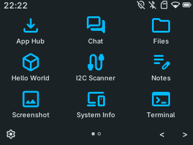
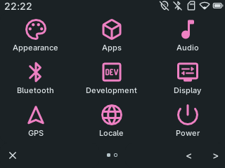
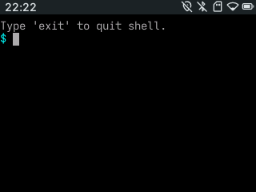
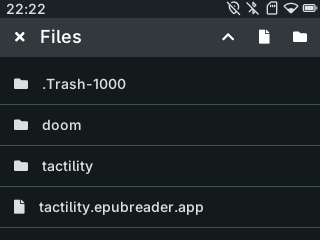

## Overview

Tactility is an operating system that focuses on the ESP32 microcontroller family.
It can load apps from SD card that were built with native C/C++ SDKs.

See [https://tactilityproject.org](https://tactilityproject.org) for more information.

  &nbsp;  

  &nbsp;  

## License

[GNU General Public License Version 3](LICENSE.md)
